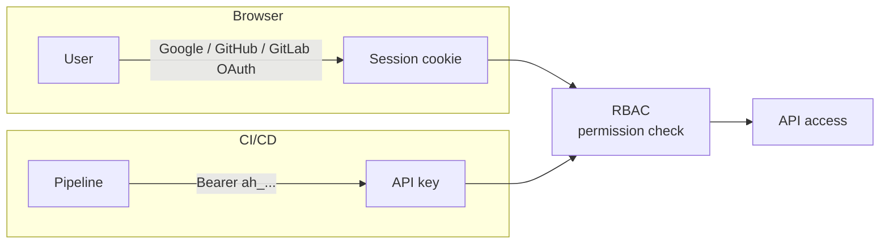
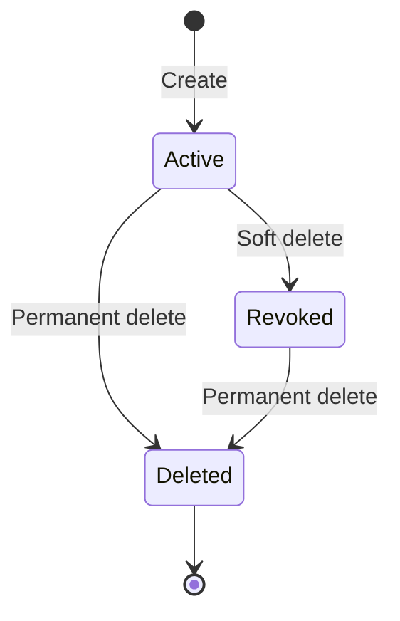

# Authentication

allure-hub supports two authentication methods: **OAuth** (for browser sessions) and **API keys** (for CI/CD and programmatic access). Both methods use the same RBAC permission model.



## OAuth providers

Any combination of **Google**, **GitHub**, and **GitLab** can be enabled simultaneously — a provider is active when both its `CLIENT_ID` and `CLIENT_SECRET` are set. Users see a login button for each active provider.

### Google

1. Go to [Google Cloud Console](https://console.cloud.google.com) > APIs & Services > Credentials > **Create OAuth 2.0 Client ID**
2. Application type: **Web application**
3. Add authorised redirect URI:

    === "Development"

        ```
        http://localhost:8080/auth/google/callback
        ```

    === "Production"

        ```
        https://your-domain.com/auth/google/callback
        ```

4. Copy the credentials into `backend/.env`:

```bash
GOOGLE_CLIENT_ID=744562771603-....apps.googleusercontent.com
GOOGLE_CLIENT_SECRET=GOCSPX-...
```

### GitHub

1. Go to **GitHub** > Settings > Developer settings > **OAuth Apps** > **New OAuth App**
2. Set the **Authorization callback URL**:

    === "Development"

        ```
        http://localhost:8080/auth/github/callback
        ```

    === "Production"

        ```
        https://your-domain.com/auth/github/callback
        ```

3. Copy the credentials into `backend/.env`:

```bash
GITHUB_CLIENT_ID=Ov23li...
GITHUB_CLIENT_SECRET=...
```

### GitLab

1. Go to **GitLab** > User Settings > Applications (or Admin > Applications for instance-wide)
2. Set the **Redirect URI**:

    === "Development"

        ```
        http://localhost:8080/auth/gitlab/callback
        ```

    === "Production"

        ```
        https://your-domain.com/auth/gitlab/callback
        ```

3. Scopes required: `read_user`
4. Copy the credentials into `backend/.env`:

```bash
GITLAB_CLIENT_ID=...
GITLAB_CLIENT_SECRET=...
```

!!! warning "BASE_URL must match exactly"
    The server constructs each callback URL as `{BASE_URL}/auth/{provider}/callback` and sends it to the OAuth provider during the login flow. The registered redirect URI in the provider console must be **character-for-character identical** — same scheme (`http` vs `https`), host, port, and path. Any mismatch produces a *"redirect_uri is not associated with this application"* error.

    | `BASE_URL` value | Callback sent to provider |
    |---|---|
    | `http://localhost:8080` | `http://localhost:8080/auth/google/callback` |
    | `https://allure.example.com` | `https://allure.example.com/auth/google/callback` |

!!! note "Development redirect"
    In development, OAuth providers redirect directly to `:8080` (the backend, bypassing Vite). Set `AUTH_AFTER_LOGIN_URL=http://localhost:5173/` so the server redirects back to the frontend after the callback completes.

## Troubleshooting

### "redirect_uri is not associated with this application"

The redirect URI sent by the server doesn't match what is registered in the OAuth provider console.

**Checklist:**

1. Confirm `BASE_URL` in `backend/.env` is set to the exact origin of your backend server (no trailing slash).
2. Open the provider's app settings and verify the registered callback URL matches `{BASE_URL}/auth/{provider}/callback` exactly.
3. After updating the provider's settings, allow a few minutes for changes to propagate before retrying.

### Login button not visible

The login page fetches active providers from `GET /auth/providers`. If no buttons appear:

- Check that at least one provider has **both** its `CLIENT_ID` and `CLIENT_SECRET` set in `backend/.env`.
- Verify the backend server is running and reachable from the browser.
- Restart the backend after changing `.env` — environment variables are read at startup.

## RBAC policy

Create `backend/policy.yaml` (gitignored). The file is watched and hot-reloaded every 30 seconds - no restart needed.

```yaml
roles:
  admin:
    permissions: ["*"]
    members:
      - alice@example.com

  developer:
    permissions: ["view", "upload"]
    members:
      - bob@example.com

  viewer:
    permissions: ["view"]

default_role: viewer
```

- `default_role` is the fallback for any authenticated user not listed in a role
- Member emails are matched **case-insensitively**
- Use `"*"` to grant all permissions (superuser)

## Permissions

| Permission | Constant | What it grants |
|---|---|---|
| `view` | `PermView` | Read-only: list environments, projects, and reports |
| `upload` | `PermUpload` | Upload results, trigger report generation |
| `manage` | `PermManage` | Create, edit, delete environments, projects, reports, and upload sessions |

## Roles summary

| Role | Permissions | Can upload | Can manage |
|---|---|---|---|
| `admin` | `*` | :material-check: | :material-check: |
| `developer` | `view`, `upload` | :material-check: | :material-close: |
| `viewer` | `view` | :material-close: | :material-close: |

## Auth endpoints

| Method | Path | Description |
|---|---|---|
| `GET` | `/auth/google` | Start Google OAuth flow |
| `GET` | `/auth/google/callback` | OAuth callback (handled by authkit) |
| `POST` | `/auth/logout` | Clear session, redirect to `AUTH_AFTER_LOGOUT_URL` |
| `GET` | `/auth/me` | Returns current user JSON or `401` |

??? example "`/auth/me` response"

    ```json
    {
      "email": "alice@example.com",
      "name": "Alice",
      "avatarUrl": "https://lh3.googleusercontent.com/...",
      "provider": "google",
      "role": "admin"
    }
    ```

## Frontend permission gating

The React frontend mirrors the RBAC logic via `AuthContext`:

```tsx
const { can } = useAuth()

// Show only for admin
{can('manage') && <button>Delete</button>}

// Show for admin and developer
{can('upload') && <UploadButton />}
```

Roles and their frontend permissions are kept in sync with `policy.yaml` via the `ROLE_PERMS` map in `AuthContext.tsx`.

## API key authentication

API keys allow CI pipelines and scripts to upload results without browser-based OAuth.

### Key format

Keys are prefixed with `ah_` followed by 64 hex characters (256 bits of entropy):

```
ah_a3f9c2d1e8b047f6a1c3d5e7f9b2a4c6d8e0f2a4c6d8e0f2a4c6d8e0f2a4c6
```

!!! info
    The `ah_` prefix aids secret scanning tools (e.g. GitHub, GitGuardian) in detecting leaked keys.

### Using an API key

Pass the key as a Bearer token in the `Authorization` header:

```bash
curl -H "Authorization: Bearer ah_..." \
     https://your-host/api/environments/$ENV_ID/projects/$PROJECT_ID/results \
     --data-binary @results.zip \
     -H "Content-Type: application/zip"
```

### Managing API keys

API keys are managed from the **Settings > API Keys** page (requires `manage` permission and an active browser session). Keys cannot be used to manage other keys.

You can also manage keys via the API - see [Settings endpoints](api.md#settings).

### Key lifecycle



| State | Description |
|---|---|
| **Active** | Key is valid and can authenticate requests |
| **Revoked** | Soft-deleted - key is rejected but the record is retained for audit |
| **Deleted** | Permanently removed |

The last-used timestamp is updated asynchronously on each successful authentication.

### Upload attribution

When a request is authenticated with an API key, the uploader is recorded as `apikey:<name>` (e.g. `apikey:ci-pipeline`) in the `uploadedBy` field on build and upload session records. OAuth-authenticated uploads record the user's email address.

## Session security

!!! danger "Production checklist"
    - Set `SECURE_COOKIE=true` - requires HTTPS
    - Generate a strong secret: `openssl rand -hex 32`
    - The secret must remain stable across restarts (changing it invalidates all sessions)

Sessions are stored in an **encrypted cookie** (AES-GCM via gorilla/securecookie).
