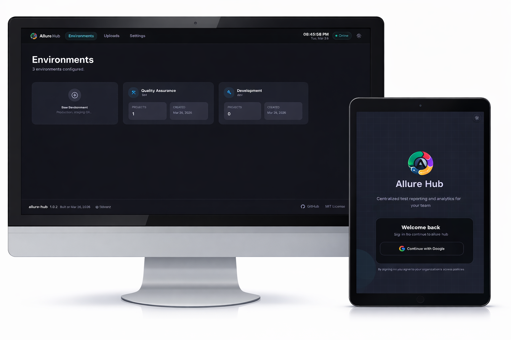
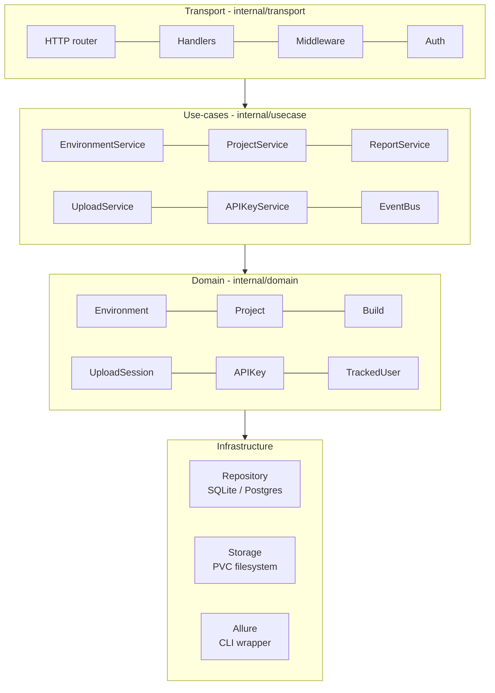
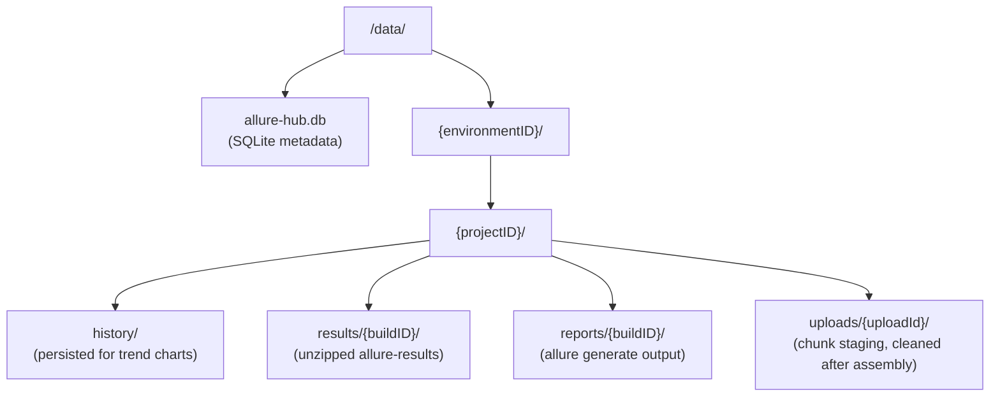

# allure-hub

Self-hosted Allure 3 reporting platform. A Go API serves the React frontend and all Allure reports from a single container - no nginx sidecar required.

## Features

- :material-folder-multiple: **Multi-environment / multi-project** - organise reports by environment (staging, production) and project
- :material-upload: **Two upload strategies** - single streaming upload or chunked upload for large files
- :material-progress-upload: **Live upload tracking** - real-time progress via SSE, visible across all connected clients
- :material-chart-line: **Allure 3 reports** - automatic history stitching for trend charts across builds
- :material-shield-lock: **Google OAuth + RBAC** - role-based access: `admin`, `developer`, `viewer`
- :material-key: **API key authentication** - issue scoped keys for CI pipelines; keys carry roles and are tracked with last-used timestamps
- :material-account-check: **Upload attribution** - every build and upload session records who triggered it (OAuth email or `apikey:<name>`)
- :material-docker: **Single container** - Go binary + Allure CLI + React SPA in one image
- :material-database: **SQLite or PostgreSQL** - SQLite for single-node; Postgres for HA
- :material-delete-clock: **Automatic data retention** - background cleanup worker deletes expired reports on a configurable schedule; run history visible in the Settings UI

---

## Architecture

## Data layout

---

## Quick links

- :material-rocket-launch: **[Getting Started](getting-started.md)** - local dev setup in 5 minutes
- :material-cog: **[Configuration](configuration.md)** - all environment variables
- :material-shield-account: **[Authentication](authentication.md)** - OAuth, RBAC, and API keys
- :material-api: **[API Reference](api.md)** - full endpoint documentation
- :material-docker: **[Docker Deployment](deployment/docker.md)** - production container setup

